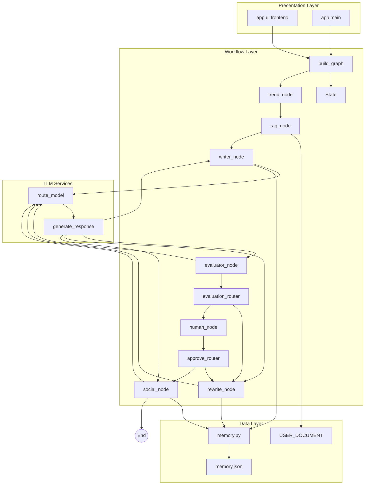
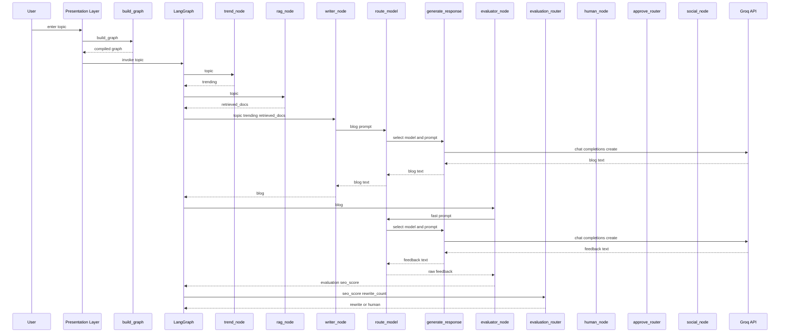
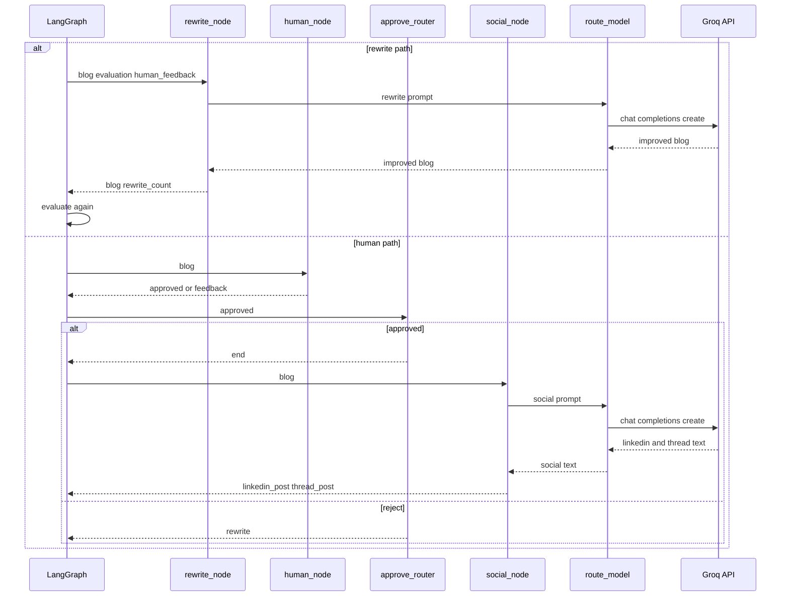
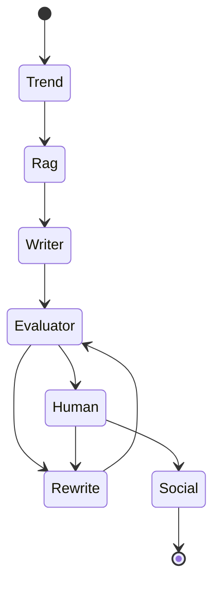

# Blog_Agent# Operational assumptions, failure modes, and implementation risks

# System Architecture and Execution Model - Operational assumptions, failure modes, and implementation risks

## Overview

This codebase runs a single LangGraph workflow that can be invoked from two surfaces:  for the CLI flow and  for the Streamlit flow. Both surfaces feed the same `topic` input into `build_graph()` and rely on the same typed state object from , so workflow correctness depends on the exact state keys emitted by each node.

The runtime is built around four tightly coupled subsystems: graph orchestration in , content-generation and review nodes in , Groq-backed model calls in  and , and local memory/RAG helpers in  and . The major operational risk is integration drift between these modules, especially where the UI expects one state key and the graph returns another.

## Operational Assumptions

- `graph.invoke()` is called with at least `{"topic": ...}`.
- Groq model responses follow the exact prompt formats expected by `evaluator_node` and `social_node`.
- The environment is populated before import time for `GROQ_API_KEY`, `DEFAULT_MODEL`, and `FAST_MODEL`.
-  is readable and writable at runtime.
- The Streamlit app is only used on flows that do not block on terminal input, even though `human_node` uses `input()`.
- `USER_DOCUMENT` is treated as the only retrieval corpus, and matching is a simple lowercase substring check.
- The final state must contain `blog`, `evaluation`, `seo_score`, `linkedin_post`, and `thread_post` for downstream persistence and display paths.

## Architecture Overview

## Component Structure

### 1. Presentation Layer

#### 

 and  both depend on the same graph, so any mismatch in State keys, node return values, or router logic affects both execution surfaces immediately.

This is the Streamlit execution surface. It collects `topic`, invokes the graph, stores the returned state in `st.session_state`, and renders editor, feedback, approval, rewrite, and social output controls.

**Runtime responsibilities**

- Creates the UI shell with `st.set_page_config()`, custom CSS, and sidebar controls.
- Invokes `build_graph()` when the user clicks `🚀 Generate Blog`.
- Stores the returned graph result in `st.session_state.result` and the current blog text in `st.session_state.blog`.
- Attempts to trigger a rewrite path from the UI using manually entered feedback fields.

**Integration points**

- Imports `build_graph` from `app.graph.builder`.
- Imports `rewriteNode` from `app.graph.nodes`, while the graph node is defined as `rewrite_node`.
- Reads `seo_score`, `evaluation`, `blog`, `linkedin_post`, and `twitter_thread` from the result object.

#### 

 imports rewriteNode, but  defines rewrite_node. As written, the Streamlit module cannot resolve that symbol. [!WARNING] The Streamlit UI checks result.get("twitter_thread"), but the graph returns thread_post. Social output is generated by the workflow but not rendered by this UI key lookup. [!WARNING] The Streamlit rewrite payload sends ai_feedback, but rewrite_node reads evaluation. The UI feedback text does not reach the prompt unless the key names are aligned. [!CAUTION] If the graph routes into human_node during a Streamlit run, input() blocks the web process waiting for terminal input. That path is CLI-oriented, not browser-oriented.

This is the CLI execution surface. It asks for a topic, runs the graph, persists the final state to local memory, and prints the latest stored interaction.

**Public functions**

| Method | Description |
| --- | --- |
| `run` | Builds the graph, reads a topic from `input()`, invokes the workflow, stores the result, and prints memory contents. |

**Execution notes**

- `run()` passes only `{"topic": user_input}` into `graph.invoke()`.
- `store_interaction(result)` runs after the graph returns, so the persisted state reflects the final workflow output.
- `display_memory()` prints the latest stored post immediately after persistence.

### 2. Workflow Layer

#### 

This module assembles the LangGraph workflow and defines the node routing graph.

**Public functions**

| Method | Description |
| --- | --- |
| `build_graph` | Creates a `StateGraph(State)`, registers nodes, wires edges and conditional routers, and returns `graph.compile()`. |

**Graph topology**

- Entry point: `trend`
- Fixed sequence: `trend -> rag -> writer -> evaluator`
- Conditional from `evaluator` via `evaluation_router`
- Loopback: `rewrite -> evaluator`
- Conditional from `human` via `approve_router`
- Terminal social stage: `social -> END`

#### 

This module contains the workflow logic for trend generation, document retrieval, draft generation, scoring, rewrite, human review, and social derivation.

**Public functions**

| Method | Description |
| --- | --- |
| `trend_node` | Builds a topic-specific list of content angles and returns them as `trending`. |
| `rag_node` | Performs lowercase substring matching against `USER_DOCUMENT` and returns `retrieved_docs`. |
| `writer_node` | Builds the blog-generation prompt, pulls memory context, and returns `blog`. |
| `evaluator_node` | Requests structured critique from the fast model, parses scores, and returns `evaluation` and `seo_score`. |
| `rewrite_node` | Rewrites the blog using `evaluation`, `human_feedback`, and retrieved docs, then returns the updated `blog` and `rewrite_count`. |
| `human_node` | Runs interactive CLI approval, edit, or rejection handling and returns `approved`, `blog` when edited, and `human_feedback`. |
| `approve_router` | Routes approved content to `end` and rejected content to `rewrite`. |
| `evaluation_router` | Routes to `human` when the score threshold or rewrite cap is reached; otherwise routes to `rewrite`. |
| `social_node` | Converts the blog into LinkedIn and Twitter-style text and returns `linkedin_post` and `thread_post`. |

**Node behavior details**

| Function | Inputs read from `State` | Outputs written to `State` | Runtime risk |
| --- | --- | --- | --- |
| `trend_node` | `topic` | `trending` | Depends on `topic` being present. |
| `rag_node` | `topic` | `retrieved_docs` | Only substring matching is used. |
| `writer_node` | `topic`, `trending`, `retrieved_docs` | `blog` | Prompt format must stay stable for parsing and memory reuse. |
| `evaluator_node` | `blog` | `evaluation`, `seo_score` | Parsing is brittle to model formatting. |
| `rewrite_node` | `blog`, `evaluation`, `human_feedback`, `retrieved_docs`, `rewrite_count` | `blog`, `rewrite_count` | Reads `evaluation`, not `ai_feedback`. |
| `human_node` | `blog` | `approved`, `blog`, `human_feedback` | Blocks on stdin. |
| `approve_router` | `approved`, `seo_score` | routing string | Depends on `approved` being set. |
| `evaluation_router` | `seo_score`, `rewrite_count` | routing string | Uses both score and retry count. |
| `social_node` | `blog`, `topic` | `linkedin_post`, `thread_post` | Parsing depends on exact prompt headings. |

#### 

human_node is the only place where approval is collected interactively from the terminal. The Streamlit UI has its own approval buttons, but they do not replace the graph’s human_node when the workflow routes there. [!NOTE] social_node returns thread_post, not twitter_thread. The social content exists in the workflow state even when the UI cannot render it under the current key name. [!NOTE] rewrite_node consumes evaluation, not ai_feedback. The current Streamlit rewrite payload does not match the state contract used by the graph. [!NOTE] evaluator_node computes score = (clarity + simplicity + engagement + seo_score) // 3. Four scores are summed, but the divisor is 3, so the derived seo_score value is inflated relative to a true four-part average.

This defines the shared graph state that all nodes read from and write to.

**Properties**

| Property | Type | Purpose |
| --- | --- | --- |
| `topic` | `str` | Primary input for all content generation. |
| `trending` | `list[str]` | Content angles produced by `trend_node`. |
| `retrieved_docs` | `list[str]` | Grounding snippets produced by `rag_node`. |
| `blog` | `str` | Current long-form blog draft. |
| `evaluation` | `str` | Raw evaluator output used by `rewrite_node`. |
| `seo_score` | `int` | Router score used by `evaluation_router`. |
| `approved` | `bool` | Human review decision used by `approve_router`. |
| `human_feedback` | `str` | Human edit or rejection notes. |
| `rewrite_count` | `int` | Loop counter used to cap rewrite cycles. |
| `linkedin_post` | `str` | Derived social post for LinkedIn. |
| `thread_post` | `str` | Derived multi-post thread content. |

**State ownership**

- `trend_node` owns `trending`.
- `rag_node` owns `retrieved_docs`.
- `writer_node` owns `blog`.
- `evaluator_node` owns `evaluation` and `seo_score`.
- `human_node` owns `approved` and `human_feedback`, and may overwrite `blog`.
- `rewrite_node` increments `rewrite_count` and overwrites `blog`.
- `social_node` owns `linkedin_post` and `thread_post`.

### 3. LLM Integration Layer

#### 

This module instantiates the Groq client and sends chat completion requests.

**Public functions**

| Method | Description |
| --- | --- |
| `generate_response` | Calls `client.chat.completions.create()` with a model name and prompt, then returns the assistant message content. |

**Initialization**

- `client` is created at module import time with `Groq(api_key=Settings.GROQ_API_KEY)`.
- The import depends on `app.config.settings.Settings`.

#### 

This module chooses which model name to use for each task type.

**Public functions**

| Method | Description |
| --- | --- |
| `route_model` | Selects `Settings.DEFAULT_MODEL` for `task_type == "blog"` and `Settings.FAST_MODEL` for all other task types, then delegates to `generate_response`. |

**Routing behavior**

- `writer_node` and `rewrite_node` use the blog model path.
- `evaluator_node` and `social_node` use the fast model path.

#### 

This module loads environment variables and exposes them through `Settings`.

**Properties**

| Property | Type | Purpose |
| --- | --- | --- |
| `GROQ_API_KEY` | `str \ | None` | Passed into the Groq client constructor. |
| `DEFAULT_MODEL` | `str \ | None` | Used for long-form blog generation. |
| `FAST_MODEL` | `str \ | None` | Used for evaluation and social derivation. |

**Module behavior**

- `dotenv.load_dotenv()` runs at import time.
- `setting = Settings()` is created at module scope.

### 4. Memory and Retrieval Layer

#### 

This module handles local JSON persistence and memory recall.

**Public functions**

| Method | Description |
| --- | --- |
| `clean_text` | Removes `**`, `*`, and `- ` patterns before storage. |
| `load_memory` | Loads , returning default empty lists if the file is missing. |
| `save_memory` | Writes the memory object back to disk with indentation. |
| `store_interaction` | Appends the latest post and feedback records to memory. |
| `get_relevant_memory` | Returns a text context assembled from the last two posts. |
| `display_memory` | Prints the latest stored post to stdout. |

**Data flow**

- `writer_node` calls `get_relevant_memory(topic)` to provide prior-post context.
- `main.py` calls `store_interaction(result)` after the graph completes.
- `main.py` calls `display_memory()` immediately after persistence.

**Storage shape**

- `posts`: topic, blog, linkedin_post, thread_post
- `feedback`: topic, human_feedback, ai_feedback

#### 

store_interaction() expects state["evaluation"] and state["human_feedback"]. Any alternate state payload, such as the Streamlit rewrite payload, will not match this persistence contract.

This is the static grounding corpus used by `rag_node`.

**Data entries**

- `I am passionate about AI and building real-world projects.`
- `I focus on machine learning, deep learning, and generative AI.`
- `I like writing educational and practical content.`
- `My goal is to become an AI engineer.`

**Operational behavior**

- Retrieval is a direct lowercase substring match against each string in `USER_DOCUMENT`.
- The retrieved list is passed unchanged into `writer_node` and `rewrite_node`.

## Execution Model

### Graph construction and content generation

### Rewrite and approval loop

### Workflow state transitions

### Major runtime assumptions by stage

1. `trend_node` assumes `topic` is available and non-empty.
2. `rag_node` assumes the topic can be matched as a lowercase substring inside `USER_DOCUMENT`.
3. `writer_node` assumes `route_model("blog", ...)` returns a structured blog payload that matches the prompt template.
4. `evaluator_node` assumes the model output contains exact prefixes for all four scores and feedback text.
5. `rewrite_node` assumes `evaluation` contains the raw evaluator text.
6. `social_node` assumes the fast model returns exact `LINKEDIN:` and `TWITTER:` blocks.

## State Management

### Typed state contract

The workflow uses a `TypedDict` instead of a class instance, so every node works against a shared dictionary payload.

| Key | Produced by | Consumed by | Notes |
| --- | --- | --- | --- |
| `topic` | UI or CLI caller | `trend_node`, `rag_node`, `writer_node`, `rewrite_node` | Required entry key. |
| `trending` | `trend_node` | `writer_node` | List of angles joined into the prompt. |
| `retrieved_docs` | `rag_node` | `writer_node`, `rewrite_node` | Passed into prompt as reference docs. |
| `blog` | `writer_node`, `rewrite_node`, `human_node` | `evaluator_node`, `rewrite_node`, `human_node`, `social_node`, memory persistence | Core draft state. |
| `evaluation` | `evaluator_node` | `rewrite_node`, `store_interaction` | Raw model critique text. |
| `seo_score` | `evaluator_node` | `evaluation_router`, `approve_router` logging | Router input. |
| `approved` | `human_node` | `approve_router` | CLI approval state. |
| `human_feedback` | `human_node` | `rewrite_node`, `store_interaction` | Human edits or rejection notes. |
| `rewrite_count` | `rewrite_node` | `evaluation_router` | Caps repeated rewrite loops. |
| `linkedin_post` | `social_node` | `store_interaction`, UI render | Derived social content. |
| `thread_post` | `social_node` | `store_interaction`, UI render path if keyed correctly | Graph output uses this exact key. |

### Key routing rules

- `evaluation_router` sends the workflow to `human` when `seo_score >= 75` or `rewrite_count >= 3`.
- `approve_router` sends approved content to `end` and rejected content to `rewrite`.
- `rewrite_node` increments `rewrite_count` on every pass, so the loop eventually escalates to human review.
- `social_node` only runs after `approve_router` returns `end`.

## Failure Modes and Integration Drift

| Symptom | Likely cause | Impact | Affected file(s) |
| --- | --- | --- | --- |
| Import error on Streamlit startup | `rewriteNode` is imported, but only `rewrite_node` is defined | UI fails before rendering | ,  |
| Social output never appears in UI | UI looks for `twitter_thread`, but graph returns `thread_post` | Social content is generated but hidden | , ,  |
| Rewrite action ignores UI feedback | UI sends `ai_feedback`, but `rewrite_node` reads `evaluation` | Rewrite prompt omits the UI’s feedback text | ,  |
| SEO score looks inflated | `evaluator_node` divides four summed scores by `3` | Router and displayed score are skewed |  |
| Streamlit hangs after generation | Workflow routes to `human_node`, which calls `input()` | Web app blocks on stdin | ,  |
| Groq call fails or uses invalid model | `GROQ_API_KEY`, `DEFAULT_MODEL`, or `FAST_MODEL` are unset | Generation and scoring requests cannot route correctly | , ,  |
| Evaluation routing loops unexpectedly | Model output does not match the exact parsing template | Fallback score of `50` or rewrite loop behavior changes |  |
| Social parsing falls back to raw output | Model output misses `LINKEDIN:` or `TWITTER:` delimiters | Output shape becomes unstructured |  |
| Retrieval returns nothing | Topic does not appear as a lowercase substring in `USER_DOCUMENT` | Writer runs without grounding context | ,  |
| Persisted memory loses formatting | `clean_text()` strips `**`, `*`, and `- ` | Stored content is normalized before JSON write |  |

## Logging

evaluator_node is sensitive to output formatting. If the model omits one score label or changes the expected line structure, parsing falls back to score = 50, which changes routing behavior. [!IMPORTANT] social_node is equally format-sensitive. Its parser expects a block starting with LINKEDIN: and another starting with TWITTER:; any deviation collapses into the fallback raw-text path. [!IMPORTANT] The Streamlit rewrite path is doubly inconsistent: the imported callable name does not match the graph definition, and the payload key names do not match the node contract even if the import is corrected.

 creates a module-scoped `logger` with `logging.getLogger(__name__)`.

**Observed log usage**

| Method | Where used | Purpose |
| --- | --- | --- |
| `logger.warning` | `rag_node` | Reports missing documents for the current topic. |
| `logger.info` | `evaluator_node`, `human_node`, `approve_router`, `evaluation_router` | Records routing decisions and approvals. |
| `logger.error` | `evaluator_node`, `social_node` | Captures parse failures and raw response snippets. |

**Operational role**

- Logging is local to the module and is used as the primary visible debugging trail for graph decisions.
- No separate telemetry or event bus layer appears in the visible code paths.

## Dependencies and Requirements Drift

### Runtime dependencies visible in code

| Dependency | Used by | Role |
| --- | --- | --- |
| `langgraph.graph.StateGraph`, `END` |  | Graph assembly and termination. |
| `groq.Groq` |  | Chat completion transport. |
| `streamlit` |  | Web UI runtime. |
| `dotenv` |  | Environment loading at import time. |
| `json`, `os`, `re` |  | Local persistence and text cleanup. |
| `logging` |  | Execution tracing. |
| `sys`, `os` |  | Import path adjustment for Streamlit. |

### Requirements drift risk

`requirements.txt` is broader than the visibly exercised code paths, so dependency verification should be tied to actual imports and runtime behavior in , , , , , , , and . Any package listed there but not used by these paths is a potential drift point during startup, deployment, or rebuilds.

## Testing Considerations

| Scenario | What to verify | Expected result |
| --- | --- | --- |
| CLI generation |  with a valid topic | Graph completes, memory stores the latest run, and output prints. |
| Streamlit generation | Topic entered in  and generate clicked | Graph result populates `st.session_state.result` and `st.session_state.blog`. |
| Rewrite routing | Low `seo_score` and `rewrite_count < 3` | Workflow routes to `rewrite_node` and loops back to `evaluator_node`. |
| Human routing | `seo_score >= 75` or `rewrite_count >= 3` | Workflow routes to `human_node`. |
| Social output parsing | Valid social model response format | `linkedin_post` and `thread_post` are extracted correctly. |
| Evaluation parsing | Invalid or incomplete model score format | Fallback `seo_score = 50` is used. |
| Memory persistence | `store_interaction()` after a successful run | JSON file contains post and feedback entries. |
| UI key alignment | Result object rendering in Streamlit | UI must look up `thread_post`, not `twitter_thread`. |
| Rewrite payload alignment | Streamlit rewrite path | Payload must supply `evaluation` if it is meant to drive `rewrite_node`. |

## Key Classes Reference

| Class | Responsibility |
| --- | --- |
| `Settings` | Reads Groq and model configuration from the environment at import time. |
| `State` | Defines the shared LangGraph payload used across trend, retrieval, generation, evaluation, review, rewrite, and social stages. |

